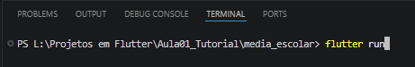

## Atividade - Calculadora de Média Escolar

### Objetivo

Desenvolver uma aplicação flutter capaz de receber o nome e 3 notas de um individuo, calcular sua média de escola

### Conceitos

- MaterialApp
- Scaffold
- StatefulWidget
- TextFild
- TextEditingController
- ElevateButton
- OutlineButton
- SetState
- Variaveis
- Conversão de texto para numero
- Condições
- Funções
- Validação de campos
- SnackBar

### Criar o Projeto Flutter

Abra o terminal e excute
```bash
    flutter create media_escolar
```

Entre na pasta do projeto:
```bash
    cd media_escolar
```

Abra o projeto no Visual Studio Code:
```bash
    code .
```

Execute o projeto:
```bash
    flutter run
```

Resultado:


### Checklist

- [X] Criar o Projeto Flutter
- [X] Criar o campo nome
- [X] Criar os três campos de nota
- [X] Criar o botão Calcular
- [X] Criar o botão Calcular Media
- [X] Verificar a situação do aluno
- [X] Mostrar o resultado
- [X] Criar o botão limpar
- [X] Validar notas entre 0 e 10
- [X] Testar o aplicativo

### Desafio
- [X] Adicionar uma quarta nota
- [X] Mostrar a maior nota
- [X] Mostrar a menor nota
- [X] Informar quantos pontos faltaram para a aprovação
- [X] Reprovar o aluno que tiver uma frequencia menor que 75%